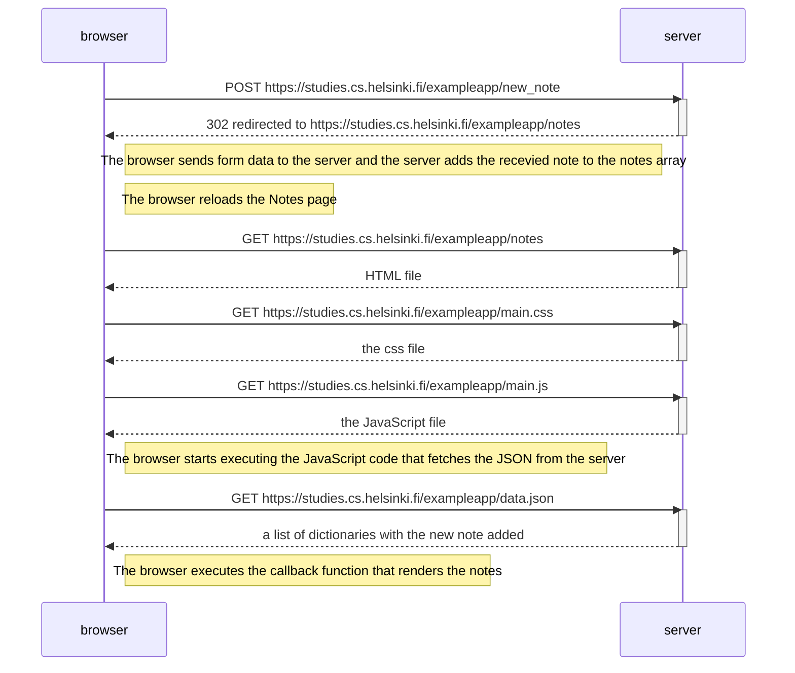

```mermaid
sequenceDiagram
    participant browser
    participant server
    
    browser->>server:  POST https://studies.cs.helsinki.fi/exampleapp/new_note 
    activate server
    server-->>browser: 302 redirected to https://studies.cs.helsinki.fi/exampleapp/notes
    deactivate server

    Note right of browser: The browser sends form data to the server and the server adds the recevied note to the notes array
    Note right of browser: The browser reloads the Notes page

    browser->>server:  GET https://studies.cs.helsinki.fi/exampleapp/notes 
    activate server
    server-->>browser: HTML file
    deactivate server
    
    browser->>server: GET https://studies.cs.helsinki.fi/exampleapp/main.css
    activate server
    server-->>browser: the css file
    deactivate server
    
    browser->>server: GET https://studies.cs.helsinki.fi/exampleapp/main.js
    activate server
    server-->>browser: the JavaScript file
    deactivate server
    
    Note right of browser: The browser starts executing the JavaScript code that fetches the JSON from the server
    
    browser->>server: GET https://studies.cs.helsinki.fi/exampleapp/data.json
    activate server
    server-->>browser: a list of dictionaries with the new note added
    deactivate server

    Note right of browser: The browser executes the callback function that renders the notes
```
